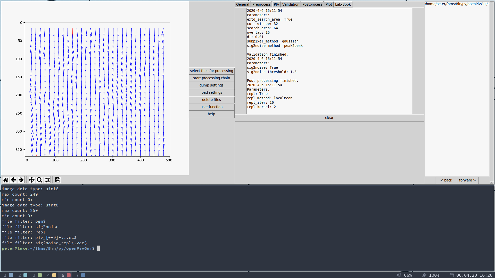

# Simple GUI for Open PIV

This graphical user interface provides an efficient workflow for evaluating and postprocessing particle image velocimetry (PIV) images, using the python libraries provided by the [OpenPiv project](http://www.openpiv.net/).



## Installation

Install `OpenPiv` first:

```
pip3 install OpenPiv
```

Then install `OpenPivGui`:

```
pip install openpivgui
```

## Launching

Launch `OpenPivGui` by executing:

```
python3 -m openpivgui.OpenPivGui
```

Alternatively, just clone this repository or manually copy the python scripts into a local directory, cd into that directory, and execute `python3 OpenPivGui.py` in your terminal.

## Using and Extending the GUI

Watch a ten minut video to learn how to use and extend OpenPivGui:

https://video.fh-muenster.de/Panopto/Pages/Viewer.aspx?id=309dccc2-af58-44e0-8cd3-ab9500c5b7f4

